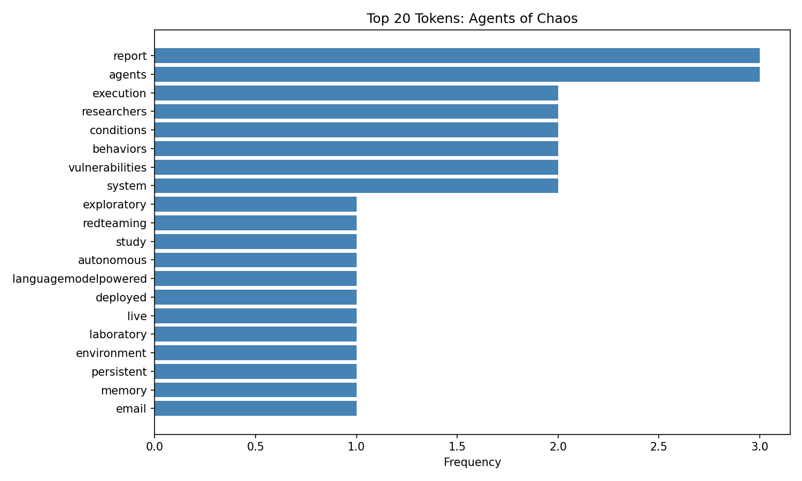
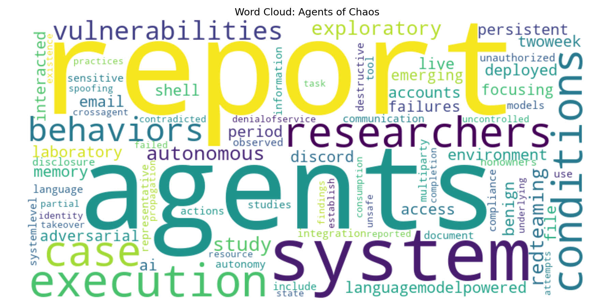

# nlp-06-nlp-pipeline

<!--additional badges are common. In your custom copy of the project, change `denisecase` to your GitHub account -->
<!--To run link checks: open your project on GitHub, click the Actions tab, select "Check Links", click "Run workflow" -->

[](https://denisecase.github.io/nlp-06-nlp-pipeline/)
[](#)
[](./LICENSE)
[](https://github.com/denisecase/nlp-06-nlp-pipeline/actions/workflows/ci-python-zensical.yml)
[](https://github.com/denisecase/nlp-06-nlp-pipeline/actions/workflows/links.yml)

> Structured EVTL pipeline for reliable extraction, cleaning, and NLP analysis of HTML web page data.
> Adds spaCy-based text cleaning and derived NLP features to the Module 5 pipeline.

Web Mining and Applied NLP require reliable acquisition and
processing of structured and semi-structured text data.
This project implements a reproducible pipeline for
working with HTML data from web pages.

The pipeline follows an **EVTAL architecture**:

- **Extract** - fetch HTML from a web page and preserve the raw artifact
- **Validate** - confirm structure and content before use
- **Transform** - an iterative loop: extract fields, clean and normalize text;
  repeat until the data is ready for analysis
- **Analyze** - engineer derived NLP features, compute frequency distributions,
  and visualize patterns to surface meaning in the text
- **Load** - write results to a persistent, analyzable format

The emphasis is on correctness, inspectability, and repeatability:
every stage has explicit inputs, outputs, and logging,
and intermediate artifacts are preserved for verification.

## This Project

This project demonstrates how to work with
HTML data retrieved from web pages using a structured EVTL pipeline.

The workflow:

- Acquire HTML from an external web page
- Inspect and validate its structure
- Transform it into a tabular representation
- Persist results for downstream analysis

Each stage is implemented as a modular component with explicit inputs and outputs.

NOTE: You do not need to understand every concept before beginning.
Instead, run the pipeline and inspect the outputs;
understanding grows by applying the process.

## Dependencies

See the pyproject.toml [dependencies] for a list of packages used:

```text
dependencies = [
    "datafun-toolkit",
    "requests",
    "beautifulsoup4",
    "lxml",
    "pandas",
    "matplotlib",
    "wordcloud",
    "spacy",
    "en-core-web-sm",
]
```

## spaCy and Language Models

This project adds [spaCy](https://spacy.io/), an industrial-strength NLP library,
to the pipeline for text cleaning and linguistic analysis.

spaCy is used in the **Transform** stage to:

- tokenize text into individual words (either by splitting on whitespace or using linguistic rules)
- identify and remove stopwords (common words with little analytical signal)
- annotate tokens with part-of-speech (POS) tags (noun, verb, adjective, etc.)
- identify named entities (NER) such as people, organizations, and dates

### Selecting Tools

spaCy is widely used in production NLP systems.
It is fast, well-documented, and integrates cleanly with Pandas and other Python tools.
Alternative libraries include **NLTK** (older, more educational) and
**Hugging Face Transformers** (more powerful, much larger).
spaCy is a good starting point for most applied NLP work.

### spaCy Language Models

spaCy requires a language model to perform linguistic analysis.
Models vary in size and capability:

| Model             | Size    | Use case                                      |
| ----------------- | ------- | --------------------------------------------- |
| `en_core_web_sm`  | ~12 MB  | Fast, sufficient for most text cleaning tasks |
| `en_core_web_md`  | ~43 MB  | Adds word vectors for similarity comparisons  |
| `en_core_web_lg`  | ~741 MB | Larger word vectors, higher accuracy          |
| `en_core_web_trf` | ~438 MB | Transformer-based, highest accuracy, slowest  |

This project uses `en_core_web_sm`.
It is small, fast, and sufficient for tokenization,
stopword removal, POS tagging, and basic NER.

IMPORTANT: The model is declared at the end of `pyproject.toml` under
**[tool.uv.sources]** and installs automatically via `uv sync`.
A total `.venv` size of 350–450 MB is normal for NLP projects.


### Selecting Models

Upgrade to `en_core_web_md` or larger when you need:

- word vector similarity (comparing how semantically similar two words are)
- higher accuracy NER on domain-specific text
- embeddings for downstream machine learning tasks

### Role in Modern NLP

Modern LLMs handle many of these tasks internally (and differently)
but fast, auditable preprocessing pipelines using tools like spaCy
remain common in production when cost, speed, and
explainability matter.
For more see, the associated
[documentation](https://denisecase.github.io/nlp-06-nlp-pipeline/)
for this project.

## Key Files

These files define the EVTL pipeline and the components you will update for your project.

- **src/nlp/pipeline_web_html.py** - Main pipeline orchestrator (no changes required)
- **src/nlp/config_case.py** - Configuration for page URL and paths (<mark>**copy and edit**</mark> for your project)
- **src/nlp/stage01_extract.py** - Extract stage: fetches HTML from a web page (no changes required)
- **src/nlp/stage02_validate_case.py** - Validate stage: inspects and verifies HTML structure (<mark>**copy and edit**</mark>)
- **src/nlp/stage03_transform_case.py** - Transform stage: extracts, cleans, and engineers NLP features (<mark>**copy and edit**</mark>)
- **src/nlp/stage04_load.py** - Load stage: writes output to persistent storage (no changes required)
- **pyproject.toml** - Project metadata and dependencies (<mark>**update**</mark> authorship, links, and dependencies)
- **zensical.toml** - Documentation configuration (<mark>**update**</mark> authorship and links)

## First: Follow These Instructions

Follow the [step-by-step workflow guide](https://denisecase.github.io/pro-analytics-02/workflow-b-apply-example-project/) to complete:

1. Phase 1. **Start & Run**
2. Phase 2. **Change Authorship**
3. Phase 3. **Read & Understand**

## Challenges

Challenges are expected.
Sometimes instructions may not quite match your operating system.
When issues occur, share screenshots, error messages, and details about what you tried.
Working through issues is an important part of implementing professional projects.

## Success

After completing Phase 1. **Start & Run**, you'll have your own GitHub project,
running on your machine, and running the example will print out:

```shell
========================
Pipeline executed successfully!
========================
```

The following artifacts will be created:

- project.log - confirming successful run
- data/raw/case_raw.html - dump of the fetched HTML
- data/processed/case_processed.csv - final loaded result

## Command Reference

The commands below are used in the workflow guide above.
They are provided here for convenience.

Follow the guide for the **full instructions**.

<details>
<summary>Show command reference</summary>

### In a machine terminal (open in your `Repos` folder)

After you get a copy of this repo in your own GitHub account,
open a machine terminal in your `Repos` folder:

```shell
# Replace username with YOUR GitHub username.
git clone https://github.com/username/nlp-06-nlp-pipeline
cd nlp-06-nlp-pipeline
code .
```

### In a VS Code terminal

```shell
uv self update
uv python pin 3.14
uv sync --extra dev --extra docs --upgrade

uvx pre-commit install
git add -A
uvx pre-commit run --all-files
# repeat if changes were made
git add -A
uvx pre-commit run --all-files

# NOTE: spaCy and en_core_web_sm English model (~200+ MB)
# has been added to pyproject.toml and will
# install automatically via the `uv sync` command above.
# Total .venv size of 350-450 MB is normal for NLP projects.

# Close any figures after viewing so execution continues
# RUN the pipeline
uv run python -m nlp.pipeline_web_html

uv run ruff format .
uv run ruff check . --fix
uv run zensical build

git add -A
git commit -m "update"
git push -u origin main
```

</details>

## Notes

- Use the **UP ARROW** and **DOWN ARROW** in the terminal to scroll through past commands.
- Use `CTRL+f` to find (and replace) text within a file.

## Example Artifact (Output)

```text
START PIPELINE
ROOT_PATH = .
DATA_PATH = data
RAW_PATH = data\raw
PROCESSED_PATH = data\processed
========================
STAGE 01: EXTRACT starting...
========================
EXTRACT: Fetching HTML from https://arxiv.org/abs/2602.20021
SOURCE URL = https://arxiv.org/abs/2602.20021
SINK PATH = data\raw\case_raw.html
========================
STAGE 02: VALIDATE starting...
========================
HTML STRUCTURE INSPECTION:
Top-level type: BeautifulSoup
Top-level elements: ['html']
VALIDATE: Title found: True
VALIDATE: Authors found: True
VALIDATE: Abstract found: True
VALIDATE: Subjects found: True
VALIDATE: Dateline found: True
VALIDATE: HTML structure is valid.
Sink: validated BeautifulSoup object
========================
STAGE 03: TRANSFORM starting...
========================
Extracting metadata from HTML
We must manually inspect the HTML structure to identify the fields we want to extract.
For this arXiv page, we can extract:
- Title from <h1 class='title'>
- Authors from <div class='authors'>
- Abstract from <blockquote class='abstract'>
- Primary subject from <div class='subheader'>
- Submission date from <div class='dateline'>
- ArXiv ID from canonical link
Replace any missing content with `unknown` to ensure all are strings.
========================
PHASE 3.1: Extract raw fields from HTML
========================
Inspect: does the raw data look right?
Look at the logged output. Does anything look surprising?
That is the first signal that cleaning is needed.
========================
------------------------
Project specific: Extract title, authors, abstract
------------------------
Extracted title: Agents of Chaos
Extracted authors: Natalie Shapira, Chris Wendler, Avery Yen, Gabriele Sarti, Koyena Pal, Olivia Floody, Adam Belfki, Alex Loftus, Aditya Ratan Jannali, Nikhil Prakash, Jasmine Cui, Giordano Rogers, Jannik Brinkmann, Can Rager, Amir Zur, Michael Ripa, Aruna Sankaranarayanan, David Atkinson, Rohit Gandikota, Jaden Fiotto-Kaufman, EunJeong Hwang, Hadas Orgad, P Sam Sahil, Negev Taglicht, Tomer Shabtay, Atai Ambus, Nitay Alon, Shiri Oron, Ayelet Gordon-Tapiero, Yotam Kaplan, Vered Shwartz, Tamar Rott Shaham, Christoph Riedl, Reuth Mirsky, Maarten Sap, David Manheim, Tomer Ullman, David Bau
Extracted abstract: We report an exploratory red-teaming study of autonomous language-model-powered agents deployed in a...
------------------------
Project specific: Extract subjects from subheader
------------------------
Extracted subjects: Computer Science > Artificial Intelligence
------------------------
Project specific: Extract submission date from dateline
------------------------
Extracted submission date: [Submitted on 23 Feb 2026]
------------------------
Project specific: Extract arxiv_id from canonical link
------------------------
Extracted arxiv_id: 2602.20021
========================
PHASE 3.2: Clean and normalize text fields
========================
Inspect: compare abstract_raw to abstract_clean in the log.
Did we remove anything we should have kept?
Is there still noise that cleaning missed?
========================
  abstract (raw):   We report an exploratory red-teaming study of autonomous language-model-powered agents deployed in a live laboratory env...
  abstract (clean): report exploratory redteaming study autonomous languagemodelpowered agents deployed live laboratory environment persiste...
  characters removed: 284 (19.7%)
========================
PHASE 3.3: Engineer derived features
========================
Inspect: do these derived fields look meaningful?
Would any additional features help the analysis?
========================
  abstract_word_count: 177
  author_count:        38
  token_count:         121
  unique_token_count:  111
  type_token_ratio:    0.9174
  top 10 tokens:       ['report', 'exploratory', 'redteaming', 'study', 'autonomous', 'languagemodelpowered', 'agents', 'deployed', 'live', 'laboratory']
========================
PHASE 3.4: Build record and create DataFrame
========================
Created DataFrame with 1 row and 13 columns
Columns: ['arxiv_id', 'title', 'authors', 'subjects', 'submitted', 'abstract_raw', 'abstract_clean', 'tokens', 'abstract_word_count', 'token_count', 'unique_token_count', 'type_token_ratio', 'author_count']
DataFrame Details
  Title: Agents of Chaos
  Author count: 38
  Abstract word count: 177
  Token count (clean): 121
  Type-token ratio: 0.9174
  DF preview:
     arxiv_id            title  token_count  type_token_ratio  author_count
0  2602.20021  Agents of Chaos          121            0.9174            38
Sink: Pandas DataFrame created
Transformation complete.
========================
STAGE 04: ANALYZE starting...
========================
========================
PHASE 4.1: Extract tokens and summary statistics
========================
  Paper: Agents of Chaos
  Abstract word count (raw):    177
  Token count (clean):          121
  Unique token count:           111
  Type-token ratio:             0.9174
  Author count:                 38
========================
PHASE 4.2: Top 20 token frequency - bar chart
========================
  Saved bar chart to data\processed\case_top_tokens.png
========================
PHASE 4.3: Word cloud
========================
  Saved word cloud to data\processed\case_wordcloud.png
========================
PHASE 4.4: Top token summary (inline)
========================
  Top 20 tokens by frequency:
      1. report                         3
      2. agents                         3
      3. execution                      2
      4. researchers                    2
      5. conditions                     2
      6. behaviors                      2
      7. vulnerabilities                2
      8. system                         2
      9. exploratory                    1
     10. redteaming                     1
     11. study                          1
     12. autonomous                     1
     13. languagemodelpowered           1
     14. deployed                       1
     15. live                           1
     16. laboratory                     1
     17. environment                    1
     18. persistent                     1
     19. memory                         1
     20. email                          1
Sink: visualizations saved to data/processed/
Analysis complete.
========================
STAGE 04: LOAD starting...
========================
SINK PATH = data\processed\case_processed.csv
========================
Pipeline executed successfully!
========================
```

## References (Optional)

- Turing (1950). *Computing Machinery and Intelligence*. https://www.csee.umbc.edu/courses/471/papers/turing.pdf
- Weizenbaum (1966). *ELIZA—A Computer Program for the Study of Natural Language Communication Between Man and Machine*. https://dl.acm.org/doi/10.1145/365153.365168
- Mikolov et al. (2013). *Efficient Estimation of Word Representations in Vector Space*. https://arxiv.org/abs/1301.3781
- Pennington et al. (2014). *GloVe: Global Vectors for Word Representation*. https://nlp.stanford.edu/projects/glove/
- Vaswani et al. (2017). *Attention Is All You Need*. https://arxiv.org/abs/1706.03762
- Shapira et al. (2026). *Agents of Chaos*. https://arxiv.org/abs/2602.20021

## Enhancements

In production systems, validation is often automated using tools
such as **Great Expectations** or **Soda**.

Within the EVTL architecture, **VALIDATE** is a key stage
with a clear source, process, and sink:

- **Source**: HTML fetched from the web page
- **Process**: parsing with BeautifulSoup, checking structure, confirming expected elements are present
- **Sink**: BeautifulSoup object passed to the TRANSFORM stage

This stage ensures the data is in a **consistent and reliable form**
before transformation begins,
so later steps can run without errors or unexpected results.

In this project, validation is implemented directly,
so all checks are visible, repeatable, and easy to review as part
of the pipeline.

## Example Output

<!-- TODO: change image links to point to your outputs -->
<!-- For example:


-->




